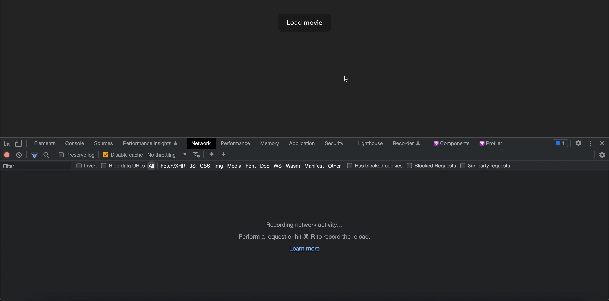
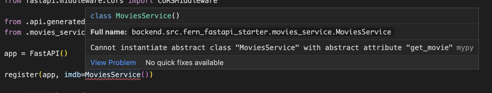
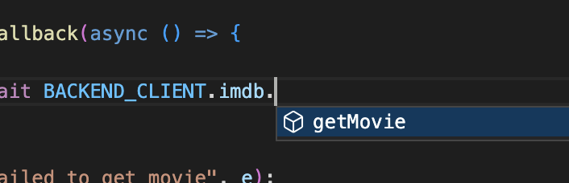

# FastAPI + React + Fern starter repo

This repo is a starter repo for building a FastAPI server + React frontend,
using [Fern](https://github.com/fern-api/fern).

**Fern is an open source format for defining REST APIs.** Fern makes it easy to:

1. Define your API
1. Implement your API on the backend
1. Consume your API on the frontend

## Quick start

### Step 1: Fork this repo

### Step 2: Clone your fork

### Step 3: Generate code

Most of the code for the backend and frontend is auto-generated by Fern!

In a terminal, run:

```
npm install -g fern-api
fern generate
```

### Step 4: Run the backend

_Prerequisite: Install [poetry](https://python-poetry.org/docs/)._

Run:

```
cd backend
poetry install
poetry run start
```

### Step 5: Run the frontend

In a new terminal, run:

```
cd frontend
yarn install
yarn start
```

Open [http://localhost:5173](http://localhost:5173) to see the frontend!



## Developing the backend

The [FastAPI](https://fastapi.tiangolo.com/) backend lives in the
[backend](backend/) directory.

To get started, open a VSCode window for the root of this repo:

```
code .
```

Install the recommended MyPy extensions. This will give you type checking in the IDE.

Install dependencies:

```
cd backend
poetry install
```

Run the server:

```
poetry run start
```

You can edit the server code, and the server will automatically reload.

### Auto-generated server code

Nearly all the FastAPI and Pydantic code is generated by Fern when you run `fern generate`.
The generated code lives in [backend/src/fern_fastapi_starter/api/generated](backend/src/fern_fastapi_starter/api/generated).

In addition to saving you time, the auto-generated code gives you compile-time safety
that your API is implemented correctly. For example, if you forget to define the `getMovie`
endpoint, you'll get a compile error:



## Developing the frontend

The frontend is generated using [React](https://reactjs.org/),
[TypeScript](https://www.typescriptlang.org/) and [Vite](https://vitejs.dev/).

To get started, open a new VSCode window for the `frontend/` directory:

```
cd frontend
code .
```

Install dependencies:

```
yarn install
```

Run the frontend:

```
yarn start
```

Open [http://localhost:5173](http://localhost:5173) to see the frontend!

You can edit the frontend code, and Vite will automatically reload your changes.

### Auto-generated API client

The API client is automatically generated by Fern when you run `fern generate`.
The generated client lives in [frontend/src/api/generated](frontend/src/api/generated). You can see it used
in [frontend/src/App.tsx](frontend/src/App.tsx),

In addition to saving you time, the auto-generated code gives you compile-time safety
and autocomplete:



## Changing the API

The API is defined using [Fern](https://www.buildwithfern.com/). The definition
lives in the [fern/](fern/api/definition) directory. You can edit these YAML files
to update the API. Check out the [docs] to read more about defining APIs.

Most of the server and frontend code in this repo is **automatically generated
by Fern.** You can regenerate the code using the Fern CLI:

```
npm install -g fern
fern generate
```

This will output newly generated code:

- Backend: [backend/src/fern_fastapi_starter/api/generated](backend/src/fern_fastapi_starter/api/generated)
- Frontend: [frontend/src/api/generated](frontend/src/api/generated)

When you change your API, you'll get compile errors on the backend if you're not
implementing the API correctly.

You can always use the command line to run mypy as well:

```
poetry run mypy
```

## Issues & contributing

If you run into any problems while using this ticket, plesae [file an
issue](https://github.com/fern-api/fastapi-starter/issues). Of course, PRs are
welcome and encouraged!
